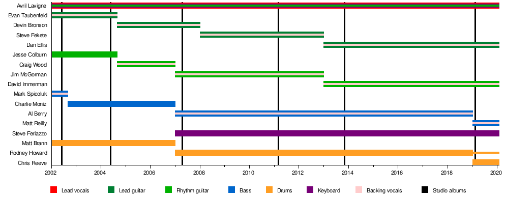

# Letting go of early 2000's Avril Lavigne

<div id="album_cover">
<style scoped>
    #album_cover img {
        width: 150px;
    }
</style>

This is me (hey! I'm Éléonore Mayola) coming to you with a crucial investigation into what happened to Avril Lavigne in the early 2000's.

This announcement might surprise you if, unlike me, you haven't wandered down the comments under one of her early YouTube video. That's where I discovered a specific group of Lavigne fans are convinced she passed away in 2003 and was replaced by a lookalike [1,2].

It is a fact that Avril Lavigne changed in both her music and style, but who doesn't change over time. The explanation being that transformation is very unlikely to be so dramatic, but then what happened?
While it is tricky to account for her personal /internal evolution, some of her musical influences (such as her support band and producing partners) can be looked at to find a correlation with her visible transformation (music and style).


[6]

Avril Lavigne's albums popularity decreased especially after the 3rd album. This third album seems different musically (tempo, energy, speechiness) and has songs viewed as part of a style called "Bubblegum Pop". It was made after she left Arista Records, and after the biggest musicians turnover in her backing band. While her style (hair, clothes) started to change between the two first albums (released in 2002 and 2004), which is consistent with her leaving teenagehood, her biggest musical change happened on the third album (2007). This change in both style and music has lost her a part of her fans. And it could obviously not be explained by the artist being replaced in 2003.
</div>


```python
import pandas as pd
import altair as alt
alt.renderers.enable('notebook')
```


    RendererRegistry.enable('notebook')


## Avril Lavigne studio albums data
[3, 4]


```python
al_albums = [
    {"name": "Let Go", "year": 2002, "genre": ["Alternative rock","Pop punk"], "global_sales": 16000000, 
     "billboard200_debut": 2, "label": ["Arista Records"], 
     "producers": ["L.A. Reid", "The Matrix", "Clif Magness", "Curt Frasca", "Peter Zizzo"]},
    {"name": "Under My Skin", "year": 2004, "genre": ["Alternative rock","Pop punk"], "global_sales": 10000000, 
     "billboard200_debut": 1, "label": ["Arista Records", "RCA Records"], 
     "producers": ["Raine Maida", "Don Gilmore", "Butch Walker"]},
    {"name": "The Best Damn Thing", "year": 2007, "genre": ["Bubblegum pop","Pop punk"], "global_sales": 6000000, 
     "billboard200_debut": 1, "label": ["RCA Records"], 
     "producers": ["Avril Lavigne", "Deryck Whibley", "Butch Walker", "Rob Cavallo", "Dr. Luke", 
                  "The Submarines", "Jesse Welch", "Steven Wolf"]},
    {"name": "Goodbye Lullaby", "year": 2011, "genre": ["Pop rock"], "global_sales": 2000000, 
     "billboard200_debut": 4, "label": ["RCA Records"], 
     "producers": ["Avril Lavigne", "Deryck Whibley", "Butch Walker", "Max Martin", "Shellback"]},
    {"name": "Avril Lavigne", "year": 2013, "genre": ["Pop", "Pop rock"], "global_sales": 650000, 
     "billboard200_debut": 5, "label": ["Epic Records"], 
     "producers": ["Avril Lavigne", "L.A. Reid", "Martin Johnson", "Peter Svensson", 
                  "David Hodges", "Matt Squire", "Chad Kroeger"]},
    {"name": "Head Above Water", "year": 2019, "genre": ["Pop rock"], "global_sales": None, 
     "billboard200_debut": 13, "label": ["BMG"], 
     "producers": ["Avril Lavigne", "Stephan Moccio", "Chris Baseford", "Johan Carlsson", 
                   "Lauren Christy", "Ryan Cabrera", "Chad Kroeger"]}
]
```


```python
df_albums = pd.DataFrame(al_albums)
```


```python
df_albums
```


<div>
<style scoped>
    .dataframe tbody tr th:only-of-type {
        vertical-align: middle;
    }

    .dataframe tbody tr th {
        vertical-align: top;
    }

    .dataframe thead th {
        text-align: right;
    }
</style>
<table border="1" class="dataframe">
  <thead>
    <tr style="text-align: right;">
      <th></th>
      <th>name</th>
      <th>year</th>
      <th>genre</th>
      <th>global_sales</th>
      <th>billboard200_debut</th>
      <th>label</th>
      <th>producers</th>
    </tr>
  </thead>
  <tbody>
    <tr>
      <td>0</td>
      <td>Let Go</td>
      <td>2002</td>
      <td>[Alternative rock, Pop punk]</td>
      <td>16000000.0</td>
      <td>2</td>
      <td>[Arista Records]</td>
      <td>[L.A. Reid, The Matrix, Clif Magness, Curt Fra...</td>
    </tr>
    <tr>
      <td>1</td>
      <td>Under My Skin</td>
      <td>2004</td>
      <td>[Alternative rock, Pop punk]</td>
      <td>10000000.0</td>
      <td>1</td>
      <td>[Arista Records, RCA Records]</td>
      <td>[Raine Maida, Don Gilmore, Butch Walker]</td>
    </tr>
    <tr>
      <td>2</td>
      <td>The Best Damn Thing</td>
      <td>2007</td>
      <td>[Bubblegum pop, Pop punk]</td>
      <td>6000000.0</td>
      <td>1</td>
      <td>[RCA Records]</td>
      <td>[Avril Lavigne, Deryck Whibley, Butch Walker, ...</td>
    </tr>
    <tr>
      <td>3</td>
      <td>Goodbye Lullaby</td>
      <td>2011</td>
      <td>[Pop rock]</td>
      <td>2000000.0</td>
      <td>4</td>
      <td>[RCA Records]</td>
      <td>[Avril Lavigne, Deryck Whibley, Butch Walker, ...</td>
    </tr>
    <tr>
      <td>4</td>
      <td>Avril Lavigne</td>
      <td>2013</td>
      <td>[Pop, Pop rock]</td>
      <td>650000.0</td>
      <td>5</td>
      <td>[Epic Records]</td>
      <td>[Avril Lavigne, L.A. Reid, Martin Johnson, Pet...</td>
    </tr>
    <tr>
      <td>5</td>
      <td>Head Above Water</td>
      <td>2019</td>
      <td>[Pop rock]</td>
      <td>NaN</td>
      <td>13</td>
      <td>[BMG]</td>
      <td>[Avril Lavigne, Stephan Moccio, Chris Baseford...</td>
    </tr>
  </tbody>
</table>
</div>


### Albums sales and debut in US charts


```python
chart1 = alt.Chart(df_albums, width=300, height=200).mark_point(size=100, filled=True, opacity=1).encode(
    alt.X('year',
        scale=alt.Scale(domain=(1999, 2019))
    ),
    y='global_sales:Q',
    color=alt.Color('name', sort=['year'])
)

chart2 = alt.Chart(df_albums, width=300, height=200).mark_bar(size=20).encode(
    x='year:O',
    y=alt.Y('billboard200_debut:Q', 
           scale=alt.Scale(domain=(0, 15))),
    color=alt.Color('name', sort=['year'])
)

chart1 | chart2
```


    <vega.vegalite.VegaLite at 0x7fe0e2056a58>


    


#### => A.L. studio albums global sales decreased with time
#### => A.L. studio albums US chart debut worsened with time


```python
albums_selection = df_albums[["year", "label", "producers"]]

pd.set_option('max_colwidth', 120)

albums_selection
```


<div>
<style scoped>
    .dataframe tbody tr th:only-of-type {
        vertical-align: middle;
    }

    .dataframe tbody tr th {
        vertical-align: top;
    }

    .dataframe thead th {
        text-align: right;
    }
</style>
<table border="1" class="dataframe">
  <thead>
    <tr style="text-align: right;">
      <th></th>
      <th>year</th>
      <th>label</th>
      <th>producers</th>
    </tr>
  </thead>
  <tbody>
    <tr>
      <td>0</td>
      <td>2002</td>
      <td>[Arista Records]</td>
      <td>[L.A. Reid, The Matrix, Clif Magness, Curt Frasca, Peter Zizzo]</td>
    </tr>
    <tr>
      <td>1</td>
      <td>2004</td>
      <td>[Arista Records, RCA Records]</td>
      <td>[Raine Maida, Don Gilmore, Butch Walker]</td>
    </tr>
    <tr>
      <td>2</td>
      <td>2007</td>
      <td>[RCA Records]</td>
      <td>[Avril Lavigne, Deryck Whibley, Butch Walker, Rob Cavallo, Dr. Luke, The Submarines, Jesse Welch, Steven Wolf]</td>
    </tr>
    <tr>
      <td>3</td>
      <td>2011</td>
      <td>[RCA Records]</td>
      <td>[Avril Lavigne, Deryck Whibley, Butch Walker, Max Martin, Shellback]</td>
    </tr>
    <tr>
      <td>4</td>
      <td>2013</td>
      <td>[Epic Records]</td>
      <td>[Avril Lavigne, L.A. Reid, Martin Johnson, Peter Svensson, David Hodges, Matt Squire, Chad Kroeger]</td>
    </tr>
    <tr>
      <td>5</td>
      <td>2019</td>
      <td>[BMG]</td>
      <td>[Avril Lavigne, Stephan Moccio, Chris Baseford, Johan Carlsson, Lauren Christy, Ryan Cabrera, Chad Kroeger]</td>
    </tr>
  </tbody>
</table>
</div>


#### => Frequent change of producers, changed labels several time

## Avril Lavigne's backing band

[3]



* 2nd album (2004): 1 new musician (since the previous album)
* 3rd album (2007): 6 new musicians
* 4th album (2011): 1 new musician
* 5th album (2013): 2 new musicians
* 6th album (2019): 2 new musicians

#### => There is no one left from the original band, they stayed for the first or two first albums
#### The 3rd album has the most new band members.

## Avril Lavigne's songs

[5]


```python
al_df = pd.read_csv('lavigne_spotify_list.csv')
```


```python
# Keep tracks from studio albums
selection = al_df.loc[al_df.year.isin(df_albums.year)]
```


```python
selection.head()
```


<div>
<style scoped>
    .dataframe tbody tr th:only-of-type {
        vertical-align: middle;
    }

    .dataframe tbody tr th {
        vertical-align: top;
    }

    .dataframe thead th {
        text-align: right;
    }
</style>
<table border="1" class="dataframe">
  <thead>
    <tr style="text-align: right;">
      <th></th>
      <th>tracks</th>
      <th>title</th>
      <th>artist</th>
      <th>top genre</th>
      <th>year</th>
      <th>added</th>
      <th>bpm</th>
      <th>nrgy</th>
      <th>dnce</th>
      <th>dB</th>
      <th>live</th>
      <th>val</th>
      <th>dur</th>
      <th>acous</th>
      <th>spch</th>
      <th>pop</th>
    </tr>
  </thead>
  <tbody>
    <tr>
      <td>0</td>
      <td>1</td>
      <td>Complicated</td>
      <td>Avril Lavigne</td>
      <td>canadian pop</td>
      <td>2002</td>
      <td>2011-11-30</td>
      <td>78</td>
      <td>78</td>
      <td>59</td>
      <td>-6</td>
      <td>30</td>
      <td>43</td>
      <td>245</td>
      <td>6</td>
      <td>5</td>
      <td>77</td>
    </tr>
    <tr>
      <td>1</td>
      <td>2</td>
      <td>Sk8er Boi</td>
      <td>Avril Lavigne</td>
      <td>canadian pop</td>
      <td>2002</td>
      <td>2011-11-30</td>
      <td>150</td>
      <td>90</td>
      <td>49</td>
      <td>-4</td>
      <td>36</td>
      <td>48</td>
      <td>204</td>
      <td>0</td>
      <td>5</td>
      <td>75</td>
    </tr>
    <tr>
      <td>2</td>
      <td>3</td>
      <td>What the Hell</td>
      <td>Avril Lavigne</td>
      <td>canadian pop</td>
      <td>2011</td>
      <td>2011-11-30</td>
      <td>150</td>
      <td>93</td>
      <td>58</td>
      <td>-4</td>
      <td>14</td>
      <td>88</td>
      <td>221</td>
      <td>0</td>
      <td>5</td>
      <td>73</td>
    </tr>
    <tr>
      <td>3</td>
      <td>4</td>
      <td>Girlfriend</td>
      <td>Avril Lavigne</td>
      <td>canadian pop</td>
      <td>2007</td>
      <td>2011-11-30</td>
      <td>164</td>
      <td>96</td>
      <td>56</td>
      <td>-2</td>
      <td>21</td>
      <td>67</td>
      <td>217</td>
      <td>0</td>
      <td>10</td>
      <td>72</td>
    </tr>
    <tr>
      <td>4</td>
      <td>5</td>
      <td>I'm with You</td>
      <td>Avril Lavigne</td>
      <td>canadian pop</td>
      <td>2002</td>
      <td>2011-11-30</td>
      <td>152</td>
      <td>41</td>
      <td>46</td>
      <td>-7</td>
      <td>12</td>
      <td>21</td>
      <td>223</td>
      <td>8</td>
      <td>3</td>
      <td>70</td>
    </tr>
  </tbody>
</table>
</div>


```python
# Add an 'album' column
albums_content = {
    "album1": {"name": "Let Go", 
               "songs": ["Losing Grip", "Complicated", "Sk8er Boi", "I'm with You", "Mobile", "Unwanted",
                         "Tomorrow", "Anything but Ordinary", "Things I'll Never Say", "My World",
                         "Nobody's Fool", "Too Much to Ask", "Naked"]},
    "album2": {"name": "Under My Skin", 
               "songs": ["Take Me Away", "Together", "Don't Tell Me", "He Wasn't",
                         "How Does It Feel", "My Happy Ending", "Nobody's Home", "Forgotten",
                         "Who Knows", "Fall to Pieces", "Freak Out", "Slipped Away"]},
    "album3": {"name": "The Best Damn Thing", 
               "songs": ["Girlfriend", "I Can Do Better", "Runaway", "The Best Damn Thing",
                         "When You're Gone", "Everything Back but You", "Hot", "Innocence",
                         "I Don't Have to Try", "One of Those Girls", "Contagious", "Keep Holding On"]},
    "album4": {"name": "Goodbye Lullaby", 
               "songs": ["Black Star", "What the Hell", "Push", "Wish You Were Here", "Smile",
                         "Stop Standing There", "I Love You", "Everybody Hurts", "Not Enough",
                         "4 Real", "Darlin", "Remember When", "Goodbye", "Alice"]},
    "album5": {"name": "Avril Lavigne", 
               "songs": ["Rock n Roll", "Here's to Never Growing Up", "17", "Bitchin' Summer",
                         "Let Me Go", "Give You What You Like", "Bad Girl", "Hello Kitty",
                         "You Ain't Seen Nothin' Yet", "Sippin' On Sunshine", "Hello Heartache",
                         "Falling Fast", "Hush Hush"]},
    "album6": {"name": "Head Above Water", 
               "songs": ["Head Above Water", "Birdie", "I Fell in Love with the Devil",
                         "Tell Me It's Over", "Mailbox", "Dumb Blonde", "It Was In Me",
                         "Souvenir", "Crush", "Goddess", "Bigger Wow", "Love Me Insane", "Warrior"]}
    }
```


```python
import string

def clean_song_title(song_title):
    song_title = song_title.lower()
    if "-" in song_title:
        song_title = song_title.split(" - ")[0]
    return song_title
```


```python
for k, v in albums_content.items():
    v["songs"] = [clean_song_title(song) for song in v["songs"]]
```


```python
def get_album_names(title):
    title = clean_song_title(title)
    if title in albums_content["album1"]["songs"]:
        return albums_content["album1"]["name"]
    if title in albums_content["album2"]["songs"]:
        return albums_content["album2"]["name"]
    if title in albums_content["album3"]["songs"]:
        return albums_content["album3"]["name"]
    if title in albums_content["album4"]["songs"]:
        return albums_content["album4"]["name"]
    if title in albums_content["album5"]["songs"]:
        return albums_content["album5"]["name"]
    if title in albums_content["album6"]["songs"]:
        return albums_content["album6"]["name"]
```


```python
selection.assign(album="")
```


<div>
<style scoped>
    .dataframe tbody tr th:only-of-type {
        vertical-align: middle;
    }

    .dataframe tbody tr th {
        vertical-align: top;
    }

    .dataframe thead th {
        text-align: right;
    }
</style>
<table border="1" class="dataframe">
  <thead>
    <tr style="text-align: right;">
      <th></th>
      <th>tracks</th>
      <th>title</th>
      <th>artist</th>
      <th>top genre</th>
      <th>year</th>
      <th>added</th>
      <th>bpm</th>
      <th>nrgy</th>
      <th>dnce</th>
      <th>dB</th>
      <th>live</th>
      <th>val</th>
      <th>dur</th>
      <th>acous</th>
      <th>spch</th>
      <th>pop</th>
      <th>album</th>
    </tr>
  </thead>
  <tbody>
    <tr>
      <td>0</td>
      <td>1</td>
      <td>Complicated</td>
      <td>Avril Lavigne</td>
      <td>canadian pop</td>
      <td>2002</td>
      <td>2011-11-30</td>
      <td>78</td>
      <td>78</td>
      <td>59</td>
      <td>-6</td>
      <td>30</td>
      <td>43</td>
      <td>245</td>
      <td>6</td>
      <td>5</td>
      <td>77</td>
      <td></td>
    </tr>
    <tr>
      <td>1</td>
      <td>2</td>
      <td>Sk8er Boi</td>
      <td>Avril Lavigne</td>
      <td>canadian pop</td>
      <td>2002</td>
      <td>2011-11-30</td>
      <td>150</td>
      <td>90</td>
      <td>49</td>
      <td>-4</td>
      <td>36</td>
      <td>48</td>
      <td>204</td>
      <td>0</td>
      <td>5</td>
      <td>75</td>
      <td></td>
    </tr>
    <tr>
      <td>2</td>
      <td>3</td>
      <td>What the Hell</td>
      <td>Avril Lavigne</td>
      <td>canadian pop</td>
      <td>2011</td>
      <td>2011-11-30</td>
      <td>150</td>
      <td>93</td>
      <td>58</td>
      <td>-4</td>
      <td>14</td>
      <td>88</td>
      <td>221</td>
      <td>0</td>
      <td>5</td>
      <td>73</td>
      <td></td>
    </tr>
    <tr>
      <td>3</td>
      <td>4</td>
      <td>Girlfriend</td>
      <td>Avril Lavigne</td>
      <td>canadian pop</td>
      <td>2007</td>
      <td>2011-11-30</td>
      <td>164</td>
      <td>96</td>
      <td>56</td>
      <td>-2</td>
      <td>21</td>
      <td>67</td>
      <td>217</td>
      <td>0</td>
      <td>10</td>
      <td>72</td>
      <td></td>
    </tr>
    <tr>
      <td>4</td>
      <td>5</td>
      <td>I'm with You</td>
      <td>Avril Lavigne</td>
      <td>canadian pop</td>
      <td>2002</td>
      <td>2011-11-30</td>
      <td>152</td>
      <td>41</td>
      <td>46</td>
      <td>-7</td>
      <td>12</td>
      <td>21</td>
      <td>223</td>
      <td>8</td>
      <td>3</td>
      <td>70</td>
      <td></td>
    </tr>
    <tr>
      <td>5</td>
      <td>6</td>
      <td>When You're Gone</td>
      <td>Avril Lavigne</td>
      <td>canadian pop</td>
      <td>2007</td>
      <td>2011-11-30</td>
      <td>142</td>
      <td>72</td>
      <td>46</td>
      <td>-4</td>
      <td>23</td>
      <td>17</td>
      <td>240</td>
      <td>19</td>
      <td>3</td>
      <td>69</td>
      <td></td>
    </tr>
    <tr>
      <td>6</td>
      <td>7</td>
      <td>My Happy Ending</td>
      <td>Avril Lavigne</td>
      <td>canadian pop</td>
      <td>2004</td>
      <td>2011-11-30</td>
      <td>170</td>
      <td>94</td>
      <td>41</td>
      <td>-2</td>
      <td>37</td>
      <td>74</td>
      <td>242</td>
      <td>0</td>
      <td>8</td>
      <td>68</td>
      <td></td>
    </tr>
    <tr>
      <td>7</td>
      <td>8</td>
      <td>Wish You Were Here</td>
      <td>Avril Lavigne</td>
      <td>canadian pop</td>
      <td>2011</td>
      <td>2011-11-30</td>
      <td>166</td>
      <td>87</td>
      <td>45</td>
      <td>-4</td>
      <td>19</td>
      <td>34</td>
      <td>226</td>
      <td>3</td>
      <td>6</td>
      <td>65</td>
      <td></td>
    </tr>
    <tr>
      <td>8</td>
      <td>9</td>
      <td>Keep Holding On</td>
      <td>Avril Lavigne</td>
      <td>canadian pop</td>
      <td>2007</td>
      <td>2011-11-30</td>
      <td>161</td>
      <td>79</td>
      <td>27</td>
      <td>-2</td>
      <td>14</td>
      <td>15</td>
      <td>240</td>
      <td>4</td>
      <td>3</td>
      <td>64</td>
      <td></td>
    </tr>
    <tr>
      <td>9</td>
      <td>10</td>
      <td>Smile</td>
      <td>Avril Lavigne</td>
      <td>canadian pop</td>
      <td>2011</td>
      <td>2011-11-30</td>
      <td>105</td>
      <td>85</td>
      <td>63</td>
      <td>-4</td>
      <td>7</td>
      <td>65</td>
      <td>210</td>
      <td>0</td>
      <td>5</td>
      <td>62</td>
      <td></td>
    </tr>
    <tr>
      <td>10</td>
      <td>11</td>
      <td>Nobody's Home</td>
      <td>Avril Lavigne</td>
      <td>canadian pop</td>
      <td>2004</td>
      <td>2011-11-30</td>
      <td>185</td>
      <td>91</td>
      <td>35</td>
      <td>-4</td>
      <td>16</td>
      <td>18</td>
      <td>212</td>
      <td>0</td>
      <td>5</td>
      <td>61</td>
      <td></td>
    </tr>
    <tr>
      <td>11</td>
      <td>12</td>
      <td>Hot</td>
      <td>Avril Lavigne</td>
      <td>canadian pop</td>
      <td>2007</td>
      <td>2011-11-30</td>
      <td>145</td>
      <td>94</td>
      <td>60</td>
      <td>-4</td>
      <td>36</td>
      <td>47</td>
      <td>203</td>
      <td>2</td>
      <td>8</td>
      <td>60</td>
      <td></td>
    </tr>
    <tr>
      <td>12</td>
      <td>13</td>
      <td>Don't Tell Me</td>
      <td>Avril Lavigne</td>
      <td>canadian pop</td>
      <td>2004</td>
      <td>2011-11-30</td>
      <td>144</td>
      <td>80</td>
      <td>52</td>
      <td>-3</td>
      <td>36</td>
      <td>48</td>
      <td>202</td>
      <td>0</td>
      <td>4</td>
      <td>59</td>
      <td></td>
    </tr>
    <tr>
      <td>13</td>
      <td>14</td>
      <td>Innocence</td>
      <td>Avril Lavigne</td>
      <td>canadian pop</td>
      <td>2007</td>
      <td>2011-11-30</td>
      <td>138</td>
      <td>71</td>
      <td>39</td>
      <td>-4</td>
      <td>20</td>
      <td>34</td>
      <td>232</td>
      <td>15</td>
      <td>3</td>
      <td>58</td>
      <td></td>
    </tr>
    <tr>
      <td>14</td>
      <td>15</td>
      <td>Losing Grip</td>
      <td>Avril Lavigne</td>
      <td>canadian pop</td>
      <td>2002</td>
      <td>2011-11-30</td>
      <td>158</td>
      <td>89</td>
      <td>53</td>
      <td>-5</td>
      <td>8</td>
      <td>58</td>
      <td>234</td>
      <td>0</td>
      <td>10</td>
      <td>58</td>
      <td></td>
    </tr>
    <tr>
      <td>15</td>
      <td>16</td>
      <td>Things I'll Never Say</td>
      <td>Avril Lavigne</td>
      <td>canadian pop</td>
      <td>2002</td>
      <td>2011-11-30</td>
      <td>102</td>
      <td>81</td>
      <td>57</td>
      <td>-5</td>
      <td>14</td>
      <td>59</td>
      <td>224</td>
      <td>0</td>
      <td>3</td>
      <td>56</td>
      <td></td>
    </tr>
    <tr>
      <td>16</td>
      <td>17</td>
      <td>Fall To Pieces</td>
      <td>Avril Lavigne</td>
      <td>canadian pop</td>
      <td>2004</td>
      <td>2011-11-30</td>
      <td>178</td>
      <td>90</td>
      <td>43</td>
      <td>-3</td>
      <td>63</td>
      <td>49</td>
      <td>209</td>
      <td>0</td>
      <td>4</td>
      <td>55</td>
      <td></td>
    </tr>
    <tr>
      <td>17</td>
      <td>18</td>
      <td>The Best Damn Thing</td>
      <td>Avril Lavigne</td>
      <td>canadian pop</td>
      <td>2007</td>
      <td>2011-11-30</td>
      <td>165</td>
      <td>94</td>
      <td>56</td>
      <td>-2</td>
      <td>15</td>
      <td>88</td>
      <td>189</td>
      <td>0</td>
      <td>9</td>
      <td>55</td>
      <td></td>
    </tr>
    <tr>
      <td>18</td>
      <td>19</td>
      <td>Anything but Ordinary</td>
      <td>Avril Lavigne</td>
      <td>canadian pop</td>
      <td>2002</td>
      <td>2011-11-30</td>
      <td>123</td>
      <td>67</td>
      <td>65</td>
      <td>-6</td>
      <td>9</td>
      <td>64</td>
      <td>251</td>
      <td>4</td>
      <td>4</td>
      <td>55</td>
      <td></td>
    </tr>
    <tr>
      <td>19</td>
      <td>20</td>
      <td>Everybody Hurts</td>
      <td>Avril Lavigne</td>
      <td>canadian pop</td>
      <td>2011</td>
      <td>2011-11-30</td>
      <td>102</td>
      <td>75</td>
      <td>45</td>
      <td>-4</td>
      <td>12</td>
      <td>36</td>
      <td>222</td>
      <td>1</td>
      <td>3</td>
      <td>54</td>
      <td></td>
    </tr>
    <tr>
      <td>20</td>
      <td>21</td>
      <td>I Love You</td>
      <td>Avril Lavigne</td>
      <td>canadian pop</td>
      <td>2011</td>
      <td>2011-11-30</td>
      <td>107</td>
      <td>80</td>
      <td>60</td>
      <td>-4</td>
      <td>32</td>
      <td>51</td>
      <td>242</td>
      <td>2</td>
      <td>3</td>
      <td>54</td>
      <td></td>
    </tr>
    <tr>
      <td>21</td>
      <td>22</td>
      <td>Slipped Away</td>
      <td>Avril Lavigne</td>
      <td>canadian pop</td>
      <td>2004</td>
      <td>2011-11-30</td>
      <td>161</td>
      <td>62</td>
      <td>45</td>
      <td>-4</td>
      <td>12</td>
      <td>10</td>
      <td>214</td>
      <td>0</td>
      <td>3</td>
      <td>54</td>
      <td></td>
    </tr>
    <tr>
      <td>22</td>
      <td>23</td>
      <td>Alice - Extended Version</td>
      <td>Avril Lavigne</td>
      <td>canadian pop</td>
      <td>2011</td>
      <td>2011-11-30</td>
      <td>119</td>
      <td>82</td>
      <td>54</td>
      <td>-4</td>
      <td>17</td>
      <td>17</td>
      <td>301</td>
      <td>5</td>
      <td>8</td>
      <td>54</td>
      <td></td>
    </tr>
    <tr>
      <td>23</td>
      <td>24</td>
      <td>Tomorrow</td>
      <td>Avril Lavigne</td>
      <td>canadian pop</td>
      <td>2002</td>
      <td>2011-11-30</td>
      <td>136</td>
      <td>79</td>
      <td>63</td>
      <td>-7</td>
      <td>16</td>
      <td>61</td>
      <td>229</td>
      <td>1</td>
      <td>3</td>
      <td>54</td>
      <td></td>
    </tr>
    <tr>
      <td>24</td>
      <td>25</td>
      <td>Take Me Away</td>
      <td>Avril Lavigne</td>
      <td>canadian pop</td>
      <td>2004</td>
      <td>2011-11-30</td>
      <td>99</td>
      <td>89</td>
      <td>51</td>
      <td>-2</td>
      <td>20</td>
      <td>26</td>
      <td>178</td>
      <td>0</td>
      <td>3</td>
      <td>53</td>
      <td></td>
    </tr>
    <tr>
      <td>25</td>
      <td>26</td>
      <td>He Wasn't</td>
      <td>Avril Lavigne</td>
      <td>canadian pop</td>
      <td>2004</td>
      <td>2011-11-30</td>
      <td>173</td>
      <td>86</td>
      <td>41</td>
      <td>-4</td>
      <td>8</td>
      <td>66</td>
      <td>179</td>
      <td>0</td>
      <td>5</td>
      <td>53</td>
      <td></td>
    </tr>
    <tr>
      <td>26</td>
      <td>27</td>
      <td>Nobody's Fool</td>
      <td>Avril Lavigne</td>
      <td>canadian pop</td>
      <td>2002</td>
      <td>2011-11-30</td>
      <td>90</td>
      <td>88</td>
      <td>50</td>
      <td>-6</td>
      <td>13</td>
      <td>46</td>
      <td>237</td>
      <td>0</td>
      <td>6</td>
      <td>53</td>
      <td></td>
    </tr>
    <tr>
      <td>27</td>
      <td>28</td>
      <td>Runaway</td>
      <td>Avril Lavigne</td>
      <td>canadian pop</td>
      <td>2007</td>
      <td>2011-11-30</td>
      <td>135</td>
      <td>94</td>
      <td>57</td>
      <td>-2</td>
      <td>16</td>
      <td>68</td>
      <td>228</td>
      <td>0</td>
      <td>5</td>
      <td>52</td>
      <td></td>
    </tr>
    <tr>
      <td>28</td>
      <td>29</td>
      <td>Remember When</td>
      <td>Avril Lavigne</td>
      <td>canadian pop</td>
      <td>2011</td>
      <td>2011-11-30</td>
      <td>148</td>
      <td>53</td>
      <td>43</td>
      <td>-6</td>
      <td>8</td>
      <td>17</td>
      <td>209</td>
      <td>3</td>
      <td>3</td>
      <td>51</td>
      <td></td>
    </tr>
    <tr>
      <td>29</td>
      <td>30</td>
      <td>Mobile</td>
      <td>Avril Lavigne</td>
      <td>canadian pop</td>
      <td>2002</td>
      <td>2011-11-30</td>
      <td>100</td>
      <td>73</td>
      <td>59</td>
      <td>-6</td>
      <td>11</td>
      <td>63</td>
      <td>212</td>
      <td>0</td>
      <td>3</td>
      <td>51</td>
      <td></td>
    </tr>
    <tr>
      <td>30</td>
      <td>31</td>
      <td>Girlfriend - Radio Edit</td>
      <td>Avril Lavigne</td>
      <td>canadian pop</td>
      <td>2007</td>
      <td>2011-11-30</td>
      <td>164</td>
      <td>96</td>
      <td>55</td>
      <td>-2</td>
      <td>25</td>
      <td>67</td>
      <td>217</td>
      <td>0</td>
      <td>11</td>
      <td>50</td>
      <td></td>
    </tr>
    <tr>
      <td>31</td>
      <td>32</td>
      <td>Unwanted</td>
      <td>Avril Lavigne</td>
      <td>canadian pop</td>
      <td>2002</td>
      <td>2011-11-30</td>
      <td>162</td>
      <td>84</td>
      <td>48</td>
      <td>-5</td>
      <td>63</td>
      <td>62</td>
      <td>221</td>
      <td>0</td>
      <td>6</td>
      <td>49</td>
      <td></td>
    </tr>
    <tr>
      <td>32</td>
      <td>33</td>
      <td>My World</td>
      <td>Avril Lavigne</td>
      <td>canadian pop</td>
      <td>2002</td>
      <td>2011-11-30</td>
      <td>103</td>
      <td>92</td>
      <td>60</td>
      <td>-5</td>
      <td>10</td>
      <td>70</td>
      <td>207</td>
      <td>1</td>
      <td>5</td>
      <td>49</td>
      <td></td>
    </tr>
    <tr>
      <td>33</td>
      <td>34</td>
      <td>Naked</td>
      <td>Avril Lavigne</td>
      <td>canadian pop</td>
      <td>2002</td>
      <td>2011-11-30</td>
      <td>82</td>
      <td>77</td>
      <td>52</td>
      <td>-6</td>
      <td>10</td>
      <td>46</td>
      <td>209</td>
      <td>0</td>
      <td>4</td>
      <td>48</td>
      <td></td>
    </tr>
    <tr>
      <td>34</td>
      <td>35</td>
      <td>Bad Reputation</td>
      <td>Avril Lavigne</td>
      <td>canadian pop</td>
      <td>2011</td>
      <td>2011-11-30</td>
      <td>103</td>
      <td>99</td>
      <td>47</td>
      <td>-3</td>
      <td>17</td>
      <td>93</td>
      <td>162</td>
      <td>0</td>
      <td>4</td>
      <td>47</td>
      <td></td>
    </tr>
    <tr>
      <td>35</td>
      <td>36</td>
      <td>Together</td>
      <td>Avril Lavigne</td>
      <td>canadian pop</td>
      <td>2004</td>
      <td>2011-11-30</td>
      <td>82</td>
      <td>86</td>
      <td>44</td>
      <td>-3</td>
      <td>23</td>
      <td>30</td>
      <td>195</td>
      <td>0</td>
      <td>4</td>
      <td>47</td>
      <td></td>
    </tr>
    <tr>
      <td>36</td>
      <td>37</td>
      <td>Too Much to Ask</td>
      <td>Avril Lavigne</td>
      <td>canadian pop</td>
      <td>2002</td>
      <td>2011-11-30</td>
      <td>147</td>
      <td>70</td>
      <td>50</td>
      <td>-7</td>
      <td>10</td>
      <td>41</td>
      <td>225</td>
      <td>1</td>
      <td>3</td>
      <td>47</td>
      <td></td>
    </tr>
    <tr>
      <td>37</td>
      <td>38</td>
      <td>Forgotten</td>
      <td>Avril Lavigne</td>
      <td>canadian pop</td>
      <td>2004</td>
      <td>2011-11-30</td>
      <td>132</td>
      <td>68</td>
      <td>57</td>
      <td>-3</td>
      <td>21</td>
      <td>35</td>
      <td>197</td>
      <td>0</td>
      <td>3</td>
      <td>46</td>
      <td></td>
    </tr>
    <tr>
      <td>38</td>
      <td>39</td>
      <td>How Does It Feel</td>
      <td>Avril Lavigne</td>
      <td>canadian pop</td>
      <td>2004</td>
      <td>2011-11-30</td>
      <td>118</td>
      <td>58</td>
      <td>65</td>
      <td>-5</td>
      <td>12</td>
      <td>34</td>
      <td>225</td>
      <td>2</td>
      <td>3</td>
      <td>46</td>
      <td></td>
    </tr>
    <tr>
      <td>39</td>
      <td>40</td>
      <td>Wish You Were Here - Acoustic Version</td>
      <td>Avril Lavigne</td>
      <td>canadian pop</td>
      <td>2011</td>
      <td>2011-11-30</td>
      <td>166</td>
      <td>55</td>
      <td>41</td>
      <td>-5</td>
      <td>9</td>
      <td>28</td>
      <td>226</td>
      <td>71</td>
      <td>3</td>
      <td>45</td>
      <td></td>
    </tr>
    <tr>
      <td>40</td>
      <td>41</td>
      <td>Freak Out</td>
      <td>Avril Lavigne</td>
      <td>canadian pop</td>
      <td>2004</td>
      <td>2011-11-30</td>
      <td>160</td>
      <td>89</td>
      <td>46</td>
      <td>-2</td>
      <td>12</td>
      <td>68</td>
      <td>192</td>
      <td>0</td>
      <td>7</td>
      <td>45</td>
      <td></td>
    </tr>
    <tr>
      <td>41</td>
      <td>42</td>
      <td>Who Knows</td>
      <td>Avril Lavigne</td>
      <td>canadian pop</td>
      <td>2004</td>
      <td>2011-11-30</td>
      <td>162</td>
      <td>81</td>
      <td>45</td>
      <td>-3</td>
      <td>11</td>
      <td>37</td>
      <td>210</td>
      <td>0</td>
      <td>4</td>
      <td>45</td>
      <td></td>
    </tr>
    <tr>
      <td>42</td>
      <td>43</td>
      <td>Push</td>
      <td>Avril Lavigne</td>
      <td>canadian pop</td>
      <td>2011</td>
      <td>2011-11-30</td>
      <td>184</td>
      <td>68</td>
      <td>52</td>
      <td>-5</td>
      <td>8</td>
      <td>47</td>
      <td>181</td>
      <td>1</td>
      <td>9</td>
      <td>44</td>
      <td></td>
    </tr>
    <tr>
      <td>43</td>
      <td>44</td>
      <td>Contagious</td>
      <td>Avril Lavigne</td>
      <td>canadian pop</td>
      <td>2007</td>
      <td>2011-11-30</td>
      <td>158</td>
      <td>91</td>
      <td>45</td>
      <td>-4</td>
      <td>32</td>
      <td>44</td>
      <td>129</td>
      <td>0</td>
      <td>5</td>
      <td>44</td>
      <td></td>
    </tr>
    <tr>
      <td>44</td>
      <td>45</td>
      <td>Stop Standing There</td>
      <td>Avril Lavigne</td>
      <td>canadian pop</td>
      <td>2011</td>
      <td>2011-11-30</td>
      <td>142</td>
      <td>89</td>
      <td>64</td>
      <td>-5</td>
      <td>7</td>
      <td>91</td>
      <td>207</td>
      <td>0</td>
      <td>5</td>
      <td>43</td>
      <td></td>
    </tr>
    <tr>
      <td>45</td>
      <td>46</td>
      <td>Darlin</td>
      <td>Avril Lavigne</td>
      <td>canadian pop</td>
      <td>2011</td>
      <td>2011-11-30</td>
      <td>179</td>
      <td>58</td>
      <td>37</td>
      <td>-5</td>
      <td>8</td>
      <td>40</td>
      <td>231</td>
      <td>21</td>
      <td>3</td>
      <td>43</td>
      <td></td>
    </tr>
    <tr>
      <td>46</td>
      <td>47</td>
      <td>Not Enough</td>
      <td>Avril Lavigne</td>
      <td>canadian pop</td>
      <td>2011</td>
      <td>2011-11-30</td>
      <td>136</td>
      <td>88</td>
      <td>52</td>
      <td>-4</td>
      <td>10</td>
      <td>24</td>
      <td>259</td>
      <td>0</td>
      <td>4</td>
      <td>43</td>
      <td></td>
    </tr>
    <tr>
      <td>47</td>
      <td>48</td>
      <td>I Don't Have To Try</td>
      <td>Avril Lavigne</td>
      <td>canadian pop</td>
      <td>2007</td>
      <td>2011-11-30</td>
      <td>212</td>
      <td>97</td>
      <td>42</td>
      <td>-3</td>
      <td>8</td>
      <td>25</td>
      <td>197</td>
      <td>0</td>
      <td>35</td>
      <td>43</td>
      <td></td>
    </tr>
    <tr>
      <td>48</td>
      <td>49</td>
      <td>One of Those Girls</td>
      <td>Avril Lavigne</td>
      <td>canadian pop</td>
      <td>2007</td>
      <td>2011-11-30</td>
      <td>92</td>
      <td>93</td>
      <td>51</td>
      <td>-3</td>
      <td>15</td>
      <td>74</td>
      <td>175</td>
      <td>0</td>
      <td>4</td>
      <td>43</td>
      <td></td>
    </tr>
    <tr>
      <td>49</td>
      <td>50</td>
      <td>Knockin' on Heaven's Door - Studio Version</td>
      <td>Avril Lavigne</td>
      <td>canadian pop</td>
      <td>2004</td>
      <td>2011-11-30</td>
      <td>138</td>
      <td>30</td>
      <td>63</td>
      <td>-8</td>
      <td>16</td>
      <td>22</td>
      <td>171</td>
      <td>84</td>
      <td>3</td>
      <td>43</td>
      <td></td>
    </tr>
    <tr>
      <td>50</td>
      <td>51</td>
      <td>Black Star</td>
      <td>Avril Lavigne</td>
      <td>canadian pop</td>
      <td>2011</td>
      <td>2011-11-30</td>
      <td>128</td>
      <td>33</td>
      <td>54</td>
      <td>-9</td>
      <td>19</td>
      <td>20</td>
      <td>94</td>
      <td>61</td>
      <td>3</td>
      <td>42</td>
      <td></td>
    </tr>
    <tr>
      <td>51</td>
      <td>52</td>
      <td>4 Real</td>
      <td>Avril Lavigne</td>
      <td>canadian pop</td>
      <td>2011</td>
      <td>2011-11-30</td>
      <td>78</td>
      <td>84</td>
      <td>52</td>
      <td>-6</td>
      <td>11</td>
      <td>28</td>
      <td>208</td>
      <td>0</td>
      <td>3</td>
      <td>42</td>
      <td></td>
    </tr>
    <tr>
      <td>52</td>
      <td>53</td>
      <td>I Always Get What I Want</td>
      <td>Avril Lavigne</td>
      <td>canadian pop</td>
      <td>2004</td>
      <td>2011-11-30</td>
      <td>91</td>
      <td>91</td>
      <td>61</td>
      <td>-3</td>
      <td>8</td>
      <td>78</td>
      <td>151</td>
      <td>0</td>
      <td>13</td>
      <td>42</td>
      <td></td>
    </tr>
    <tr>
      <td>53</td>
      <td>54</td>
      <td>What The Hell - Acoustic Version</td>
      <td>Avril Lavigne</td>
      <td>canadian pop</td>
      <td>2011</td>
      <td>2011-11-30</td>
      <td>150</td>
      <td>67</td>
      <td>61</td>
      <td>-3</td>
      <td>11</td>
      <td>52</td>
      <td>221</td>
      <td>52</td>
      <td>3</td>
      <td>39</td>
      <td></td>
    </tr>
    <tr>
      <td>54</td>
      <td>55</td>
      <td>Push - Acoustic Version</td>
      <td>Avril Lavigne</td>
      <td>canadian pop</td>
      <td>2011</td>
      <td>2011-11-30</td>
      <td>92</td>
      <td>59</td>
      <td>50</td>
      <td>-5</td>
      <td>31</td>
      <td>16</td>
      <td>166</td>
      <td>7</td>
      <td>3</td>
      <td>37</td>
      <td></td>
    </tr>
    <tr>
      <td>55</td>
      <td>56</td>
      <td>Imagine</td>
      <td>Avril Lavigne</td>
      <td>canadian pop</td>
      <td>2007</td>
      <td>2011-11-30</td>
      <td>147</td>
      <td>25</td>
      <td>29</td>
      <td>-11</td>
      <td>9</td>
      <td>21</td>
      <td>192</td>
      <td>93</td>
      <td>3</td>
      <td>36</td>
      <td></td>
    </tr>
    <tr>
      <td>58</td>
      <td>59</td>
      <td>Smile - Radio Edit</td>
      <td>Avril Lavigne</td>
      <td>canadian pop</td>
      <td>2011</td>
      <td>2011-11-30</td>
      <td>105</td>
      <td>85</td>
      <td>63</td>
      <td>-4</td>
      <td>8</td>
      <td>67</td>
      <td>209</td>
      <td>0</td>
      <td>4</td>
      <td>0</td>
      <td></td>
    </tr>
    <tr>
      <td>59</td>
      <td>60</td>
      <td>Goodbye</td>
      <td>Avril Lavigne</td>
      <td>canadian pop</td>
      <td>2011</td>
      <td>2011-11-30</td>
      <td>87</td>
      <td>33</td>
      <td>19</td>
      <td>-7</td>
      <td>12</td>
      <td>26</td>
      <td>329</td>
      <td>72</td>
      <td>3</td>
      <td>0</td>
      <td></td>
    </tr>
    <tr>
      <td>60</td>
      <td>61</td>
      <td>I Can Do Better</td>
      <td>Avril Lavigne</td>
      <td>canadian pop</td>
      <td>2007</td>
      <td>2011-11-30</td>
      <td>172</td>
      <td>98</td>
      <td>44</td>
      <td>-3</td>
      <td>64</td>
      <td>29</td>
      <td>195</td>
      <td>0</td>
      <td>18</td>
      <td>0</td>
      <td></td>
    </tr>
    <tr>
      <td>61</td>
      <td>62</td>
      <td>Everything Back But You</td>
      <td>Avril Lavigne</td>
      <td>canadian pop</td>
      <td>2007</td>
      <td>2011-11-30</td>
      <td>130</td>
      <td>97</td>
      <td>54</td>
      <td>-3</td>
      <td>35</td>
      <td>50</td>
      <td>182</td>
      <td>1</td>
      <td>17</td>
      <td>0</td>
      <td></td>
    </tr>
  </tbody>
</table>
</div>


```python
for idx, row in selection.iterrows():
    album_name = get_album_names(row.title)
    selection.loc[idx, "album"] = album_name
```


```python
selection.head()
```


<div>
<style scoped>
    .dataframe tbody tr th:only-of-type {
        vertical-align: middle;
    }

    .dataframe tbody tr th {
        vertical-align: top;
    }

    .dataframe thead th {
        text-align: right;
    }
</style>
<table border="1" class="dataframe">
  <thead>
    <tr style="text-align: right;">
      <th></th>
      <th>tracks</th>
      <th>title</th>
      <th>artist</th>
      <th>top genre</th>
      <th>year</th>
      <th>added</th>
      <th>bpm</th>
      <th>nrgy</th>
      <th>dnce</th>
      <th>dB</th>
      <th>live</th>
      <th>val</th>
      <th>dur</th>
      <th>acous</th>
      <th>spch</th>
      <th>pop</th>
      <th>album</th>
    </tr>
  </thead>
  <tbody>
    <tr>
      <td>0</td>
      <td>1</td>
      <td>Complicated</td>
      <td>Avril Lavigne</td>
      <td>canadian pop</td>
      <td>2002</td>
      <td>2011-11-30</td>
      <td>78</td>
      <td>78</td>
      <td>59</td>
      <td>-6</td>
      <td>30</td>
      <td>43</td>
      <td>245</td>
      <td>6</td>
      <td>5</td>
      <td>77</td>
      <td>Let Go</td>
    </tr>
    <tr>
      <td>1</td>
      <td>2</td>
      <td>Sk8er Boi</td>
      <td>Avril Lavigne</td>
      <td>canadian pop</td>
      <td>2002</td>
      <td>2011-11-30</td>
      <td>150</td>
      <td>90</td>
      <td>49</td>
      <td>-4</td>
      <td>36</td>
      <td>48</td>
      <td>204</td>
      <td>0</td>
      <td>5</td>
      <td>75</td>
      <td>Let Go</td>
    </tr>
    <tr>
      <td>2</td>
      <td>3</td>
      <td>What the Hell</td>
      <td>Avril Lavigne</td>
      <td>canadian pop</td>
      <td>2011</td>
      <td>2011-11-30</td>
      <td>150</td>
      <td>93</td>
      <td>58</td>
      <td>-4</td>
      <td>14</td>
      <td>88</td>
      <td>221</td>
      <td>0</td>
      <td>5</td>
      <td>73</td>
      <td>Goodbye Lullaby</td>
    </tr>
    <tr>
      <td>3</td>
      <td>4</td>
      <td>Girlfriend</td>
      <td>Avril Lavigne</td>
      <td>canadian pop</td>
      <td>2007</td>
      <td>2011-11-30</td>
      <td>164</td>
      <td>96</td>
      <td>56</td>
      <td>-2</td>
      <td>21</td>
      <td>67</td>
      <td>217</td>
      <td>0</td>
      <td>10</td>
      <td>72</td>
      <td>The Best Damn Thing</td>
    </tr>
    <tr>
      <td>4</td>
      <td>5</td>
      <td>I'm with You</td>
      <td>Avril Lavigne</td>
      <td>canadian pop</td>
      <td>2002</td>
      <td>2011-11-30</td>
      <td>152</td>
      <td>41</td>
      <td>46</td>
      <td>-7</td>
      <td>12</td>
      <td>21</td>
      <td>223</td>
      <td>8</td>
      <td>3</td>
      <td>70</td>
      <td>Let Go</td>
    </tr>
  </tbody>
</table>
</div>


```python
# Remove songs that haven't been associated to an album
songs_data = selection.loc[selection["album"].notnull()]
```


```python
# Tempo (BPM)
chart3 = alt.Chart(songs_data, width=200, height=200).mark_boxplot(opacity=0.7).encode(
    x='year:O',
    y='bpm:Q',
    color=alt.Color('album', sort=['year']),
    tooltip=['title', 'bpm']
).interactive()

# Energy
chart4 = alt.Chart(songs_data, width=200, height=200).mark_boxplot(opacity=0.7).encode(
    x='year:O',
    y='nrgy:Q',
    color=alt.Color('album', sort=['year']),
    tooltip=['title', 'nrgy']
).interactive()

# Danceability
chart5 = alt.Chart(songs_data, width=200, height=200).mark_boxplot(opacity=0.7).encode(
    x='year:O',
    y='dnce:Q',
    color=alt.Color('album', sort=['year']),
    tooltip=['title', 'dnce']
).interactive()

# Positive Mood (Valence)
chart6 = alt.Chart(songs_data, width=300, height=300).mark_boxplot(opacity=0.7).encode(
    x='year:O',
    y='val:Q',
    color=alt.Color('album', sort=['year']),
    tooltip=['title', 'val']
).interactive()

# Acousticness
chart7 = alt.Chart(songs_data, width=300, height=300).mark_boxplot(opacity=0.7).encode(
    x='year:O',
    y='acous:Q',
    color=alt.Color('album', sort=['year']),
    tooltip=['title', 'acous']
).interactive()

# Speechiness
chart8 = alt.Chart(songs_data, width=300, height=300).mark_boxplot(opacity=0.7).encode(
    x='year:O',
    y='spch:Q',
    color=alt.Color('album', sort=['year']),
    tooltip=['title', 'spch']
).interactive()

# Popularity
chart9 = alt.Chart(songs_data, width=300, height=300).mark_boxplot(opacity=0.7).encode(
    x='year:O',
    y='pop:Q',
    color=alt.Color('album', sort=['year']),
    tooltip=['title', 'pop']
).interactive()
```


```python
# Tempo (BPM) | Energy | Danceability
chart3 | chart4 | chart5
```


    <vega.vegalite.VegaLite at 0x7ff5aa054d30>


    


```python
# Positive Mood (Valence) | # Acousticness
chart6 | chart7
```


    <vega.vegalite.VegaLite at 0x7ff5aa2259e8>


    


```python
# Speechiness | Popularity
chart8 | chart9
```


    <vega.vegalite.VegaLite at 0x7ff5aa314940>


    


#### => Musically, songs from the 3rd record seem more upbeat (as reflected by their BPM and energy) and have more lyrics. Songs on the 4th album are more acoustic.

#### Using songs from an open Spotify playlist [5] shows the 1st and 2nd album are more similar (energy, acousticness, speechiness and popularity) and the 1st and fourth album are also quite close (BPM, danceability and speechiness).
It'd be interesting to try this analysis on songs from the 2 last studio albums.

**References**

Conspiracy
* [1] https://www.theguardian.com/lifeandstyle/shortcuts/2017/may/15/avril-lavigne-melissa-cloning-conspiracy-theories
* [2] https://avrilestamorta.blogspot.com/

Data for analysis
* [3] https://en.wikipedia.org/wiki/Avril_Lavigne
* [4] https://en.wikipedia.org/wiki/Avril_Lavigne_discography
* [5] spotify open playlist : https://open.spotify.com/playlist/4i9NgLPXnTQsLYrzrq6WhE analyzed using http://organizeyourmusic.playlistmachinery.com

Other
* [6] photos: https://avrillavigne.com/music/
* MTV docu, 2007: https://www.youtube.com/watch?v=f8GLe10jLSw


```python

```
